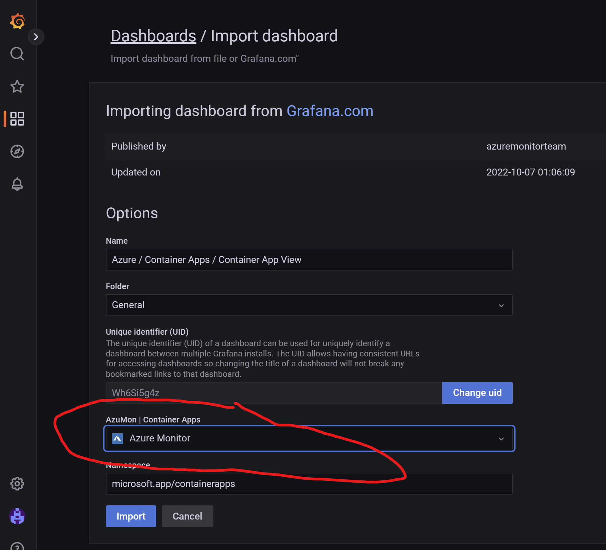

# Lab_12 Utilisation de Dashboard Grafana pour monitorer Azure Container Apps

tags: #azure #azurecontainerapps #azurecli #cli #monitoring #grafana #dashboard


## Objectif:

Utiliser Azure Grafana pour avoir des dashboards Grafana exposant des métriques ACA


## Pré-requis sur le poste d'administration
- Un abonnement Azure avec les privilèges d'administration (idéalement owner, sinon ce sera compliqué)
- Un environnement Shell sous Bash
- Azure CLI 2.37 or >: [https://docs.microsoft.com/en-us/cli/azure/install-azure-cli?view=azure-cli-latest](https://docs.microsoft.com/en-us/cli/azure/install-azure-cli?view=azure-cli-latest) 

Les opérations sont réalisables depuis l'Azure Cloud Shell (Bash Shell) : https://shell.azure.com 

/!\ être owner sur la subscription

Lors du déploiement d'Azure Managed Grafana, il faut avoir le role Owner sur la subscription. Cela permet d'assigner le rôle Monitoring Reader à l'instance Azure Managed Grafana afin d'autoriser la lecture des données d'Azure Monitor sur l'ensemble de la subscription.

 Also, the Grafana Admin role should be assigned to your account so that you can manage and authenticate to the Grafana dashboard portal using Azure Active Directory.


## Déployer une plateforme ACA
cf. Lab_11

## Déployer un Azure Managed Grafana

### Affectation des variables  (REMPLACER La valeur de LOG_ANALYTICS_NAME par la votre, ainsi que votre nom d'instance GRAFANA)

```bash
RESOURCE_GROUP="RG-Lab12"
LOCATION="eastus"
CONTAINERAPPS_ENVIRONMENT="my-environment"
LOG_ANALYTICS_NAME="Logs-Lab-11"
GRAFANA_NAME="stangrafana2023"

az group create \
  --name $RESOURCE_GROUP \
  --location $LOCATION -o table
```

Installer l'extension Grafana pour Azure CLI

```bash
az grafana list
```

La commande va vous proposer d'installer l'extension grafana

```bash
The command requires the extension amg. Do you want to install it now? The command will continue to run after the extension is installed. (Y/n):
```

Répondre Y

Les commandes az grafana sont disponibles ici : https://learn.microsoft.com/en-us/cli/azure/grafana?view=azure-cli-latest


```bash
az grafana create \
  --name $GRAFANA_NAME \
  --resource-group $RESOURCE_GROUP \
  --verbose \
  -o jsonc
```

Récupérer dans la sortie de la commande précédente l'URL de votre instance Azure Managed Grafana. (le endpoint URL se termine par eus.grafana.azure.com)

<br>

Ouvrir un nouvel onglet dans votre navigateur et copier/coller l'URL obtenue.

Le single Sign On avec Azure Active Directory devrait fonctionner et permet d'arriver dans l'UI de Grafana

Compléter ensuite la configuration de votre instance Grafana

<br>

<br>

<br>

Importer le modèle dashboard : https://grafana.com/grafana/dashboards/16592-azure-container-apps-container-app-view/

<br>

<br>

<br>

<br>


Configuration de Grafana, Lecture additionnelle : https://learn.microsoft.com/en-us/azure/azure-monitor/visualize/grafana-plugin 


## Nettoyage

```bash
az group delete -n "RG-Lab12" --yes
az group delete -n "RG-Lab11" --yes
``` 

## Lectures complémentaires

Exemple de code Terraform pour Azure Managed Grafana
https://paulyu.dev/article/monitoring-azure-container-apps-with-azure-managed-grafana/ 


